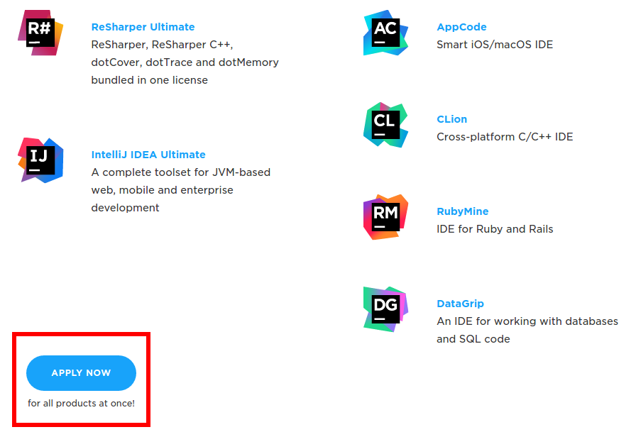
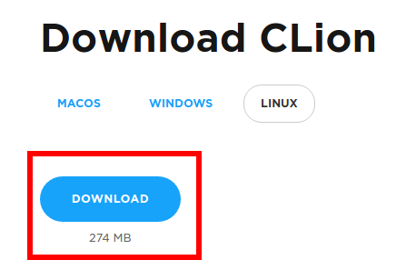

# CLion Tutorials

CLion is an IDE developed by JetBrains for development of C/C++.

Its project structure uses CMake, which is well compatible with ROS.

We decided to use CLion as a standard platform for development this semester,

because it is convenient for newcomers to C/C++, and it is free for students (as of other JetBrains IDEs).

## Creating a JetBrains Student Account

JetBrains offer free licenses to students to facilitate their learning experiences.

1. Go to the [Signup URL](https://www.jetbrains.com/student/).

2. Click "Apply Now".


3. Enter your credentials, etc. and follow along the instructions.

## Installation

1. Check that you have more than 274 MB left in your storage. 

2. Go to [Download URL](https://www.jetbrains.com/clion/download/)

3. Click on the download link.



4. When Download finishes, decompress the archive:

    ```bash
    cd ${Your-Download-Directory}
    tar -xvzf CLion-*-.tar.gz
    ```
   If your archive name doesn't match the format above, change the command to match the filename.

5. Launch CLion:

	```bash
	cd  ${Your-CLion-Directory}/bin
	./clion.sh
	```

6. When you're first starting up, you have an option to configure CLion. Default is probably fine for most purposes.

7. Lock to Launcher

If you so choose, you may lock CLion to Launcher by right-clicking the icon on your Ubuntu Navigation Bar and selecting "Lock to Launcher".

## Project Management

This part of the documentation is currently incomplete.

[Here](https://www.jetbrains.com/clion/documentation/) is a video tutorial of the CLion IDE.

## Setting up CLion for ROS

Before running CLion, you must ensure that the ROS environment variables have been sourced.
Check your .bashrc for the following lines:

```bash
source /opt/ros/indigo/setup.bash;
source ~/catkin_ws/devel/setup.bash;
```

and then launch CLion from the terminal:

```bash
cd /bin
./clion.sh
```

## Creating a Desktop Entry

Follow the [tutorial above](#setting-up-clion-for-ros) before following this guide.

Copy clion.desktop to your desktop directory and edit its contents:

```bash
cp clion.desktop ~/Desktop
vim clion.desktop
```

You should see:

```bash
[Desktop Entry]
Version=1.0
Type=Application
Name=CLion
GenericName=Integrated Development Environment
Icon=<YOUR_CLION_DIRECTORY>/bin/clion.svg
Exec=bash -i -c <YOUR_CLION_DIRECTORY>/bin/clion.sh %f
Comment=Develop with pleasure!
Categories=Development;IDE;
Terminal=false
StartupWMClass=jetbrains-clion
```

From the file, replace <YOUR_CLION_DIRECTORY> with path to your clion directory.
This configures this desktop entry to start clion in the terminial, effectively sourcing your ~/.bashrc.
