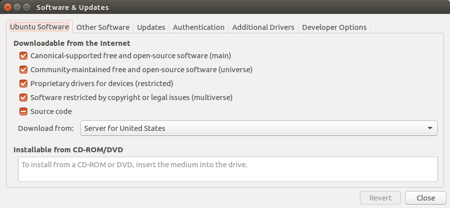

## ROS Installation

[Here](http://wiki.ros.org/indigo/Installation/Ubuntu) are the official installation directions.

Assuming that your OS is Ubuntu 14.04, this should be a very intuitive, linear process.

Otherwise, there are also [Other options](http://wiki.ros.org/ROS/Tutorials/InstallingIndigoInChroot) which utilizes Debootstrap to install indigo in a 14.04 image in a debian-based system.

Below is a verbatim transcription of the official guide, with our comments for explanation.

### Checking Upstream Repository Permissions
1. Press the Super button (Windows Logo on Keyboard) to invoke the launcher.


2. Type 'Software' and click on "Software and Updates."



3. Verify that all of the checkboxes for main, universe, restricted and multiverse are checked.

### Installing ROS

1. Setup your computer to accept packages from packages.ros.org:

	```bash
	sudo sh -c 'echo "deb http://packages.ros.org/ros/ubuntu $(lsb_release -sc) main" > /etc/apt/sources.list.d/ros-latest.list'
	```

2. Setup Keys for the KeyServer:

	```bash
	sudo apt-key adv --keyserver hkp://ha.pool.sks-keyservers.net --recv-key 0xB01FA116	
	```

3. Update your Repository Lists:

	```bash
	sudo apt-get update
	```

	Generally, it is considered good practice to update before installing packages.

4. Install ROS, as full desktop version:

	```bash
	sudo apt-get install ros-indigo-desktop-full
	```

	Often, this would take a very long time. Connect your computer to an ethernet cable to not clog up the WiFi network.

5. Initialize rosdep

	```bash
	sudo rosdep init
	rosdep update
	```
	
	rosdep is a convenient tool that allows you to automatically install dependencies for ros packages.

6. Environment Setup

	```bash
	echo "source /opt/ros/indigo/setup.bash" >> ~/.bashrc
	source ~/.bashrc	
	```

	This configures your terminal so that it would recognize variables and commands related to ROS.
