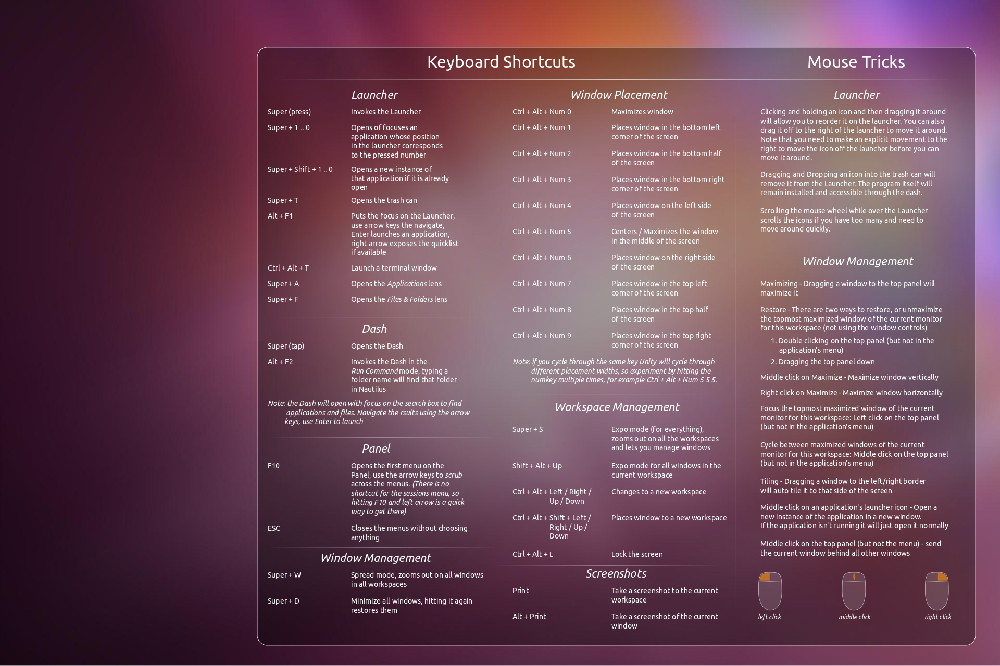

## Ubuntu

### In this Folder

- Quick introduction (this page)

- [Installation](install.md)

- [Configuration](configure.md)

- [Terminal](terminal.md)

### Why Ubuntu? 

Part of the reason we use Ubuntu is because you can basically pretend it is windows for most general uses of your computer and everything will be fine. The desktop environment has desktop icons, a task bar for your programs, and a quick launch/sear function like the windows button. (this is the thing on your task bar whose icon is a circle with three dots around it).

The main user interface difference between windows and ubuntu is the [terminal](terminal.md).There are a lot of other useful things you can do from the terminal, some other terminal commands are shown above, also google is your friend.

### Appendix

#### Ubuntu Shortcuts

