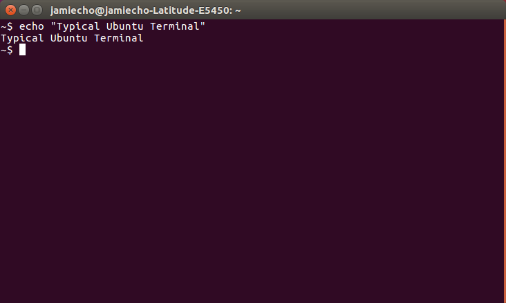

## Using the Terminal

[Official Guide](https://help.ubuntu.com/community/UsingTheTerminal)

Unlike Windows, which is primarily composed of GUI(Graphical User Interface), users would often use the Terminal(CLI) in Ubuntu or Mac OSX.
The Terminal CLI(Command-Line Interface) is an extremely powerful tool that lets you manage processes, navigate the filesystem, and basically program your interaction with the OS.
Because of how well-developed this feature is, programmers often prefer working in a Linux environment as opposed to Windows.



Shown above is a typical terminal window. You can also bring up a terminal with shortcut `Ctrl+Alt+T`.

You can actually do pretty much anything from the terminal.

To start, you can think of it as a file manager that lets you do a lot more interesting things.

When you open the terminal, it will be in your "home" directory (denoted by the tilde to the right of your name).

## Features

### Tab-Complete

[Short Demo](https://youtu.be/esD6UFf0SnU)

Here's something to make your life easier: tab complete.

Any time you are entering a command in the terminal, press tab and it will try and guess what you are typing.

For example, if you type `cd Doc` and press tab, it will automatically fill in `Documents` because there is no other directory you could be talking about.

If there are multiple options, first nothing will happen, but if you press tab a second time, it will show you all of the possible things you could be asking it to fill in.

For example, from the home directory, if you type `cd D` then press tab twice, it should show you `Documents/ Desktop/ and Downloads/` (along with any other folder you have that starts with D).

Note, the `/` after the names is telling you that those are folders.

### Pipe


## Commands

### FileSystem Navigation

#### ls
To see the contents of this directory, you can type `ls` and press enter.

This "lists" the contents of the current directory.

#### cd

```bash
cd <directory_name>
cd
cd ..
```

You can change directories use `cd <directory_name>` (ex. `cd Documents` will move you into the Documents directory).

Your current directory will always be shown in the command prompt (the text to the left of the $).

Use `cd` with no input to return to your home directory.

### Clearing your Terminal

```bash
clear
```

clear simply gets rid of all the text in your terminal by simply pushing it upwards.
If you scroll up, you can still see the output from old commands.

```bash
reset
```

Sometimes, simply clearing just doesn't cut it. For example, if you're looking for a particular text from a program output, it doesn't help that the program has been run multiple times.
Use reset when you want to completely reset the cache for the terminal.

### Helpful Commands

```bash
help <args>
man <args>
info <args>
```

If you want to look up a syntax for a command, or what it does, one of the three above commands will (most likely) tell you.

## Appendix

### Common Terminal Commands Cheat Sheet 

- `cd <directory_name>` - change directory
  - `cd` - go to home directory
  - `cd ..` - go "up" one directory
- `ls` - list contents of current directory
- `cp <file> <destination>` - coppy a file to a new location or name
- `mv <file> <destination>` - move a file to a new location or name (doesn't preserve original)
- `rm <file>` - delete a file
- `apt-get` - handles programs
  - `apt-get install` - install a program
  - `apt-get update` - update your computer's knowledge of programs
  - `apt-get upgrade` - upgrade your programs
- `sudo` - give command admin privlages (ususally needed for `apt-get` commands)
- `echo` - Output the same string as the input. This is often used for chaining via piping arguments into processes.
- `export` - Sets a variable in the terminal
  - `export x="five"` - set x to string "five"
- `grep` - Search for String.
  - `grep <string> <file>` - search for a string in a file.
  - `grep -r <string> <directory>` - search for a string recursively.
- `history` - Show your recent commands history.
